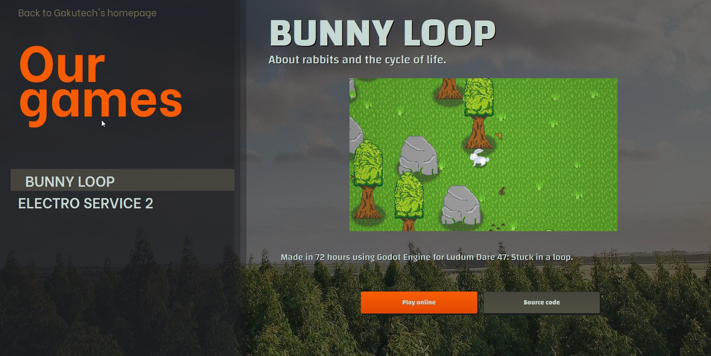

# Gakutech Games FrontEnd

Just a frontend made in react for our game listing site.

## Adding/Removing entries

Edit `src/Resources/games.json` to add game data (title, description, ...) and add your background and preview images/gifs to the `public/game_data/` folder.

## Building

Run `docker build -t gakutech-games-fe .` on the project's root.

## Deploying

Run `docker run --rm -p 3000:3000 gakutech-games-fe`, or better yet, run with docker-compose.

## Credits

Made with love by the Gakutech team (*Angela Cobos* and *Joaquín León*).